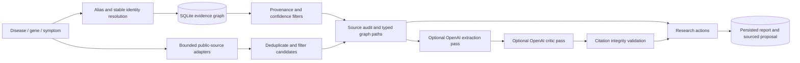

**English** | [简体中文](README.zh-CN.md)

# Asterisk — AI Atlas for Rare Diseases

*Rare, but never alone.*

Asterisk is a backend-first demo that implements challenge [05.pdf](05.pdf) for **Maria, a patient organization leader**, and for the experts she works with. Search a disease, gene, or symptom; inspect a sourced network; find existing infrastructure; and download a research collaboration proposal with explicit validation questions.

**Every new search builds a live graph**, without a hardcoded disease list. Disease, gene, and symptom queries retrieve public ontology identities, publications, studies, authors, and PubTator gene/disease/variant mentions, then assemble a scoped, evidence-backed graph. Results and source outages are visible. Exact identity/synonym matches resolve automatically; ambiguous identities remain search context until selected. This provides broad on-demand coverage, not a verified census of all rare diseases or validated biology for every disease.

The **STXBP1/SLC6A1 starter** remains available through **Open the example map**: 22 nodes and 29 manually curated relationships. It demonstrates deeper mechanism and shared-registry interpretation. New live graphs do not reuse its disease-specific facts, labels, or actions.

Agent provider setup, including **Bright Data** and a **Lovable backend agent**, is documented in [docs/AGENT_SETUP.md](docs/AGENT_SETUP.md). The integrations keep keys server-side.

## Interface

- **First-visit intro.** Opening the home page shows the Asterisk logo and two identities: **Patient & family** and **Expert**. The chosen card flies into the identity picker in the top-right corner, the logo settles into place, and the search page fades in. The intro is skipped for shared links (`#q=…`, `#example`) and simplified when the system requests reduced motion.
- **Two identities.** The identity picker in the header offers only these two identities, and switching is possible at any time. The identity decides how AI reviews are written (see [API](#api)); it does not change the evidence.
- **Living world map.** Behind the home search, a solid world map (Natural Earth 1:50m, Antarctica omitted) stays dim and lights up in brand blue, with country borders, around the pointer. Home text uses dark ink with a soft halo so it stays readable over the lit map.
- **Liquid-glass controls.** The language picker, the identity picker, and **Sources & coverage** are frosted glass pills with a pointer-following sheen and spring animations. They support keyboard navigation (arrows, Enter, Esc, Tab).
- **Sources & coverage dialog.** Color-coded source tiles show whether each source is live, curated, unavailable, or planned. The dialog also lists known gaps and presents the 10× planning hypothesis as a stat card.
- **English / Simplified Chinese.** The language choice is saved locally and initially follows the browser language. The interface, intro, pickers, and coverage dialog are fully translated. Source evidence, publications, and reports keep their original language; search using English names or standard identifiers. Translations live in `web/i18n.js`; detailed backend explanations remain in their source language.

Brand source files (logo, mark, app icon) are in [docs/brand](docs/brand).

## Run locally with Conda

```powershell
cd Raraction
conda env create -f environment.yml
conda activate raraction
python -m atlas.server
```

Open **http://127.0.0.1:8000**. Python's standard library provides the HTTP server, SQLite, HTTPS clients, XML parsing, jobs, and tests; there are no pip or JavaScript dependencies. An existing Conda environment with Python 3.12+ also works without environment creation. No separate database server is needed. (The repository and Conda environment keep the original `raraction` name.)

If Conda's optional plugins fail on your machine, use `conda --no-plugins env create -f environment.yml`. `--port 8001` and `--db data/another.sqlite` are supported.

The committed starter snapshots work offline. New searches need outbound HTTPS; repeated retrievals use a one-hour cache unless explicitly refreshed. Live graph views persist in SQLite and survive restarts. Source outages produce a sparse graph with provider status, rather than substituting the starter's biology. The server binds to the local machine by default and sends a strict Content-Security-Policy (`script-src 'self'`, so the web client uses no inline scripts). This demo has no user authentication or production deployment configuration; run it locally for judging.

### OpenAI contribution without a paid API key

The challenge announcement permits OpenAI tools such as Codex. Our pipeline is:

1. public biomedical snapshots
2. deterministic filtering and provenance checks
3. OpenAI Codex evidence review
4. schema, citation, and checksum verification
5. a precomputed review in the working demo

`prompts/codex_review.md`, `data/codex/evidence.json`, `schema.json`, `review.json`, and `manifest.json` provide reviewable inputs, output, and provenance. The included review was authored in the OpenAI Codex coding session, **not a separately executed CLI run**. Verification checks structure, citation membership, and evidence binding; it does not prove scientific entailment. Human scientific review remains necessary.

To regenerate using your authenticated Codex CLI (subject to your Codex account's access and usage limits):

```powershell
python scripts/codex_review.py prepare
Get-Content -Raw prompts/codex_review.md | codex exec --sandbox read-only --output-schema data/codex/schema.json --output-last-message data/codex/review.json -
python scripts/codex_review.py seal
python scripts/codex_review.py verify
```

Review the output and diff before committing the prompt, evidence, schema, review, and manifest. No API key or Codex credentials belong in Git. `seal` records a user-run CLI origin, so use it only after actually running the command above; otherwise keep the truthful original manifest. The committed manifest records the review's original audience as `maria`, the name of the patient audience at the time.

For the key-free reproducible demo:

```powershell
$env:ATLAS_AGENT_PROVIDER = 'codex_snapshot'
python -m atlas.server
```

Choose **Patient & family** and English, open the example map, keep its default filters, then click **Review evidence** with **Agent review** enabled. The model contribution is clearly recorded as `codex_snapshot_review`: no live inference occurs. Its exact packet binding prevents replay on another disease, changed filters, refreshed records, or the Expert identity. Other live searches continue to work through public APIs and deterministic evidence checks; disable Agent review for those searches unless a live provider is configured. Initial starter data and its review work without network or paid providers.

In the tech video:

- Show the source snapshots, the committed prompt and evidence, the verification command, the starter graph, and the reviewed proposal.
- Explain that Codex produced the precomputed brief and the deployed demo replays that exact artifact; distinguish this from live API retrieval and optional live model calls.
- State that citation verification is not independent biological validation.

## Maria's one-minute journey

1. Open the app and choose **Patient & family**. Click **Open the example map** to start at STXBP1-related disorder, or search `STXBP1 encephalopathy`, `MUNC18-1`, or `low muscle tone` to see identity and synonym resolution. Ambiguous results require an explicit choice.
2. Select a connection. Inspect its relationship, observation/hypothesis status, curator confidence, provenance, caveat, and linked source.
3. Follow the connection to **Simons Searchlight**: both communities have existing registry infrastructure. Reuse of measures is a research proposal, not assumed compatibility.
4. Inspect **NCT04937062**: its downloaded record names both conditions and both patient organizations. The snapshot is **ACTIVE_NOT_RECRUITING**, last updated **2026-01-22**. Its existence supports a shared research lead, not clinical efficacy or personal eligibility.
5. Select **Review evidence**. Read questions about data dictionaries, consent, disease-specific outcomes, and variant-specific assays. Download the sourced proposal; the app sends no outreach.
6. Search **Gaucher disease**, **Fabry disease**, another rare disease, a gene, or a symptom. Search builds a new live graph automatically. Select a line to inspect its source and exact meaning. A returned publication or automated entity mention is not a validated causal relationship. If identity cannot be resolved, the root remains explicitly labeled search context.

Switch the identity to **Expert** at any time to get a review written in scientific and clinical terms over the same evidence.

## Backend architecture



| File | Responsibility |
| --- | --- |
| `atlas/store.py` | Normalized nodes, aliases, edges, sources, evidence joins, persisted reports, prepared SQLite queries |
| `atlas/seed.py` | Transparent curated relationships, stable identities, paper/study snapshot transformation |
| `atlas/providers.py` | PubMed, Europe PMC, NCBI Gene, MONDO/HPO through OLS, ClinicalTrials.gov; bounded results, NCBI rate limit, one-hour disk cache |
| `atlas/live_graph.py` | On-demand identity, literature, study, author and PubTator mention graphs; isolated persistent graph views |
| `atlas/integrations.py` | Server-only Bright Data retrieval and authenticated external agent webhook; HTTPS, allowlists, redirect rejection |
| `atlas/graph.py` | Evidence gate, typed neighborhoods, shortest cited paths, degree centrality, asset/collaboration ranking, coverage statement |
| `atlas/audiences.py` | The two trusted audience profiles (`patient`, `expert`) that shape AI review wording |
| `atlas/agent.py` | Filtered evidence packet, source integrity audit, two optional model passes, citation guard, research actions and export |
| `atlas/server.py` | HTTP API, bounded asynchronous analysis queue, report endpoints, allowlisted static files, security headers |
| `web/index.html`, `web/app.js`, `web/styles.css` | Responsive, dependency-free page: home search, interactive SVG graph, paper view, evidence inspector, action view, coverage dialog |
| `web/i18n.js` | English / Simplified Chinese interface translations |
| `web/intro.js` | First-visit identity intro and its hand-off animation |
| `web/glass-select.js` | Liquid-glass pickers layered over the native `<select>` elements, which stay the source of truth |
| `web/home-world.js`, `web/world-map.js` | Pointer-lit world map canvas and its pre-projected land/border paths |

Every edge includes direction, relationship type, source IDs and locators, review date, confidence and its basis, observation/inference/dispute status, and a caveat. Navigation may traverse an edge in either direction, but its stored biological semantics remain directed. Every proposed action references graph-edge IDs. Publication authors use publication-scoped IDs until actual identity disambiguation is available.

Starter mechanism categories are manually curated research layers. Live graph categories describe record types, not discovered mechanism clusters. Search-result edges are documented retrieval relationships; PubTator mentions are labeled inferred automated annotations with passage locations. Neither means the query disease causes, responds to, or shares a mechanism with another entity.

Node size uses observed-edge degree; degree centrality measures connectivity, not medical importance. Opportunity ranking uses shared infrastructure, asset type, and shorter paths with an inference penalty; it is not a treatment ranking. Live reports explicitly say biological routes have not been validated.

## Agent setup and its actual validation scope

Without a key, the app runs **evidence checks**, not a simulated LLM. To enable the OpenAI option, set environment variables **before starting the server**:

```powershell
$env:OPENAI_API_KEY = 'your-key'
$env:OPENAI_MODEL = 'gpt-4.1-mini'
python -m atlas.server
```

The model is configurable. `.env.example` documents the variables; the app does not automatically load `.env`. Never commit a key. The browser never receives it.

The [Responses API](https://developers.openai.com/api/docs/guides/structured-outputs) uses strict structured output and `store: false`.

- **Pass one** extracts observations and candidate claims from the filtered packet.
- **Pass two** critiques the draft for unsupported equivalence, contradictions, paper relevance, and missing validation.

The packet includes original downloaded publication abstracts and study metadata, plus curated edges and optional live candidates. GeneReviews and community full text remain external cited links. Citation IDs must belong to the supplied packet; invalid citations reject the review. Errors preserve the deterministic evidence-check result.

**Automated provenance checks and model critique do not independently establish scientific truth.**

- Two passes with the same model and evidence are not independent replication.
- PubMed and Europe PMC copies of one paper share a publication lineage and count once. Distinct papers can share cohorts, authors, or experiments.
- A full-text expert review is still required to confirm claim entailment, variant effects, independent support, applicability, and clinical decisions.
- Model outputs never write biological edges into the graph or promote candidates to validated facts.

Live papers exclude missing abstracts, flagged retractions, and preprints by default. Retraction detection is limited to the publication metadata returned by the adapters, not a comprehensive integrity screen. Preprints can be explicitly included through the API. All imported candidates remain unreviewed.

## API

| Method | Endpoint | Result |
| --- | --- | --- |
| GET | `/api/health` | Backend status and whether an OpenAI key is configured |
| GET | `/api/search?q=STXBP1&kind=auto` | Curated matches, matched synonym, ambiguity, scope |
| GET | `/api/graph?focus=MONDO:0012812&min_confidence=moderate&include_inferred=true` | Filtered graph, provenance checks, clusters, exclusions |
| GET | `/api/coverage` | Current source integrations, omissions, scope and 10× hypothesis |
| POST | `/api/live-search` | Bounded public identity, paper and study candidates with provider statuses |
| POST | `/api/live-graph` | Build and persist a live graph for an arbitrary query; return graph_id, focus, typed nodes/edges, provenance and coverage |
| POST | `/api/analysis` | Queued evidence review; HTTP 202 and job ID |
| GET | `/api/jobs/{id}` | Stage and completion state; jobs are ephemeral |
| GET | `/api/reports/{id}` | Persisted evidence review and research actions |
| GET | `/api/reports/{id}/proposal` | Downloadable sourced Markdown discussion draft |

Example analysis body:

```json
{
  "focus": "MONDO:0012812",
  "role": "patient",
  "min_confidence": "moderate",
  "include_inferred": true,
  "use_live": true,
  "use_openai": true
}
```

**Live-search body:** `{"query":"STXBP1","kind":"auto","include_preprints":false}`. Supported primary search kinds are disease, gene and symptom, with auto resolution. Additional curated nodes can be searched by organization, mechanism, asset, paper, study, researcher, or institution.

**Audiences.** AI reviews support two `role` values, with `language` set to `en` or `zh-CN`:

- `patient` (**Patient & family**, the default): plain language, every technical term explained, and a concrete question to ask an expert.
- `expert` (**Expert**): one profile for researchers, clinicians, and R&D professionals. It uses scientific and clinical terminology, and covers mechanism, phenotype specificity, endpoints, evidence maturity, and feasibility.

Any other role is rejected with HTTP 400. Both model passes adapt terminology and detail while preserving citations and uncertainty. The identity is chosen on the intro screen or in the header picker; changing identity or language requires a new review. Rule-based checks and graph evidence retain their original wording; separate role-specific research workflows are not implemented. Exports include the audience-adapted AI review alongside the baseline sourced proposal. Reports persist across server restarts; job IDs do not.

**Live-graph body:** `{"query":"Gaucher disease","kind":"auto","refresh":false}`.

- Set `refresh:true` for fresh public-source retrieval.
- To refine an ambiguous identity, pass `identity_id` from the returned identity candidates.
- For later filtering and review, pass the returned `graph_id` to `/api/graph` or `/api/analysis`. This preserves exactly the selected query's evidence and prevents unrelated searches from contaminating its neighborhood.
- Use `use_agent:true` for the selected configured agent provider. No agent key is included in requests from the browser.

## Sources and dataset reproduction

Primary implemented sources prioritize the user's established public databases:

- [MONDO via EMBL-EBI OLS](https://www.ebi.ac.uk/ols4/) and [HPO](https://hpo.jax.org/) for stable identities and terms.
- [NCBI Gene / PubMed E-utilities](https://www.ncbi.nlm.nih.gov/home/develop/api/) for gene identity and publications; [Europe PMC](https://europepmc.org/RestfulWebService) for paper metadata and abstracts.
- [ClinicalTrials.gov v2](https://clinicaltrials.gov/data-api/api) for studies, status, eligibility and named collaborators.
- [STXBP1 GeneReviews](https://www.ncbi.nlm.nih.gov/books/NBK396561/) and [SLC6A1 GeneReviews](https://www.ncbi.nlm.nih.gov/books/NBK589173/) for curated mechanism and phenotype summaries.
- [Simons Searchlight STXBP1](https://www.simonssearchlight.org/research/what-we-study/stxbp1/) and [SLC6A1 Connect registry](https://slc6a1connect.org/registry/) for verified existing community infrastructure.
- The home background map is derived from [world-atlas](https://github.com/topojson/world-atlas) `countries-50m` ([Natural Earth](https://www.naturalearthdata.com/), public domain).

```powershell
python scripts/fetch_snapshot.py
python scripts/verify_snapshot.py
python -m atlas.server
```

`data/snapshots/manifest.json` records retrieval timestamps, exact upstream URLs, per-file SHA-256 hashes, and unavailable providers. The snapshot includes primary publication IDs **26865513, 38137001, 33241211, 38781976** and study **NCT04937062**.

SQLite is reconstructed from `atlas/seed.py` plus the snapshots at startup; downloaded records and human-curated relationships remain separate. For a fully new dataset, pass a fresh path with `--db`. Existing seed inserts are idempotent and preserve reports.

Refreshing a snapshot does not perform a comprehensive curator review, remove old records, or validate new biological claims. Revise the curator code and review date before publishing a changed dataset.

An identity safeguard matters: **SLC6A1-NDD is not synonymous with all myoclonic-atonic epilepsy**. The demo uses a local stable disease ID for SLC6A1-NDD until a specific ontology mapping has been confirmed. MONDO's exact STXBP1 term is `MONDO:0012812`. Gene effects are gene-level summaries; this slice contains no patient-specific variant interpretation.

Integration status beyond the primary sources:

- **Reactome**: mapping requests failed and are recorded as unavailable; no pathway membership was invented.
- **PubTator3**: contributes live entity mentions with character offsets, conservatively labeled as automated candidates.
- **Planned, not yet working**: **ClinVar/ClinGen**, **Gene2Phenotype**, **OpenAlex** author disambiguation, **NIH RePORTER**, and model databases. Their deeper variant effects, funding, and infrastructure are not advertised as working integrations.
- **Not included**: OMIM would require appropriate licensing/access. Full GeneReviews text and patient records are not redistributed.

NCBI information: [Disclaimer and Copyright](https://www.ncbi.nlm.nih.gov/About/disclaimer.html). Follow source terms before redistributing or deploying a larger dataset.

## Validation

```powershell
python -m unittest discover -s tests -v
```

The 44 tests cover:

- **Evidence model**: provenance, filtering and counterexamples, source-lineage deduplication, shared-asset paths, identity mismatch, no-route behavior, study-status caveats, and original evidence packets.
- **AI review**: fabricated model citations, mocked two-pass reviews, and both audience profiles.
- **Live data and storage**: provider outages, SQLite persistence, search, arbitrary-query live graphs, unresolved identity, PubTator mention semantics, and persisted graph isolation.
- **HTTP and security**: HTTP jobs and exports, endpoint allowlists, server-only credentials, and reflected-secret rejection.

Public-source adapters were also exercised live for STXBP1. The OpenAI workflow's orchestration and citation guards were tested with mocked responses; a real model call requires the user's key and has not been run in this build.

The web interface (intro, pickers, coverage dialog, both languages, phone width) was checked in headless Chrome. Optional `scripts/browser_check.py` uses the development machine's installed Chrome and websocket-client for UI QA; those are not runtime dependencies. Set `ATLAS_TEST_BROWSER` to another Chromium executable if necessary.

## Challenge coverage and the next slice

This demo addresses the graph builder, explainable connections, reusable assets, partner leads, and a concrete weekly research action. Counterexamples stay visible when hypotheses are hidden. Unknown searches disclose coverage rather than invent a supported route.

The 10× milestone is explicitly an **illustrative planning hypothesis**: reduce the time to a registry-measure reuse decision from 70 days to 7 days by finding existing infrastructure early. It assumes prompt partner responses, compatible consent and measures, clinician review, and no new ethics approval for the initial feasibility decision. It does not claim measured acceleration toward treatment; compare actual decision times against prior projects to validate it.

Next steps:

- Confirm variant-specific mechanisms and ontology mappings.
- Add claim-level independent and contradictory evidence.
- Disambiguate researchers, and ingest grants and models.
- Grow the two identities into separate expert workflows over the same evidence model, for Devon, Priya, and Dr. Osei from the challenge.

The local HTTP server is suitable for the prototype. Production needs authentication, per-user report ownership, robust job persistence and rate limits, managed serving, and a systematic curator refresh process.
