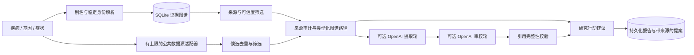

[English](README.md) | **简体中文**

# Asterisk — 罕见病 AI 知识图谱

*罕见，但从不孤单。*

Asterisk 是一个以后端为核心的演示项目，实现了挑战题 [05.pdf](05.pdf)。它面向**患者组织负责人 Maria**，以及与她合作的专家。你可以搜索疾病、基因或症状，查看有来源依据的关系网络，找到已有的研究基础设施，并下载一份列明待验证问题的研究合作提案。

**每次新搜索都会实时构建图谱**，不依赖写死的疾病列表。系统针对疾病、基因和症状检索公共本体中的身份、论文、研究、作者，以及 PubTator 标注的基因、疾病和变异提及，然后组装成一个范围明确、有证据支撑的图谱。检索结果和数据源故障都会公开显示。完全匹配的身份或同义词会自动解析；有歧义的身份在用户选择之前只作为检索上下文。这提供的是广泛的按需覆盖，而不是对全部罕见病的核实清单，也不代表每种疾病的生物学机制都已验证。

**STXBP1/SLC6A1 入门示例**可通过"**打开示例图谱**"访问，包含 22 个节点和 29 条人工整理的关系，用来展示更深入的机制解读和共享登记库分析。新的实时图谱不会复用它的疾病特定事实、标签或行动建议。

智能体（Agent）服务的配置，包括 **Bright Data** 和 **Lovable 后端智能体**，见 [docs/AGENT_SETUP.md](docs/AGENT_SETUP.md)。所有集成的密钥都只保存在服务器端。

## 界面

- **首次访问的开场页。** 打开主页时，会先显示 Asterisk 标志和两个身份：**患者与家属**、**专家**。选中的卡片会飞入右上角的身份切换按钮，标志归位，搜索页随后渐次进入。通过分享链接（`#q=…`、`#example`）打开时不显示开场页；系统开启"减少动态效果"时，动画会简化。
- **两个身份。** 页头的身份切换只提供这两个身份，随时可以切换。身份决定 AI 审阅的写法（见 [API](#api)），不改变证据本身。
- **会亮起的世界地图。** 主页搜索框背后是一张实体世界地图（Natural Earth 1:50m，不含南极洲）。平时保持暗淡，鼠标附近会以品牌蓝亮起并显示国界。主页文字使用深色并带柔和光晕，在亮起的地图上也清晰可读。
- **液态玻璃控件。** 语言切换、身份切换和"**来源与覆盖范围**"按钮都是磨砂玻璃胶囊，带跟随鼠标的高光和弹性动画，并支持键盘操作（方向键、Enter、Esc、Tab）。
- **来源与覆盖范围窗口。** 用颜色区分每个数据来源的状态：实时接入、人工整理、暂不可用、计划接入。窗口还列出已知缺口，并以数据卡片的形式展示"十倍提速"规划假设。
- **英文 / 简体中文。** 语言选择保存在本地，首次访问时跟随浏览器语言。界面、开场页、切换控件和来源窗口都已完整翻译。原始证据、论文和报告保留原文；搜索建议使用英文名称或标准标识符。翻译文本位于 `web/i18n.js`；后端的详细解释保留原始语言。

品牌源文件（完整标志、图形标志、应用图标）位于 [docs/brand](docs/brand)。

## 使用 Conda 在本地运行

```powershell
git clone https://github.com/bqy12346/asterisk.git
cd asterisk
conda env create -f environment.yml
conda activate raraction
python -m atlas.server
```

打开 **http://127.0.0.1:8000**。HTTP 服务器、SQLite、HTTPS 客户端、XML 解析、任务队列和测试全部由 Python 标准库提供，不需要任何 pip 或 JavaScript 依赖。已有的 Python 3.12+ Conda 环境也可以直接使用，无需新建环境，也不需要单独的数据库服务器。（Conda 环境仍沿用原名 `raraction`。）

如果 Conda 的可选插件在你的机器上报错，可以使用 `conda --no-plugins env create -f environment.yml`。支持 `--port 8001` 和 `--db data/another.sqlite` 参数。

已提交的入门快照可离线使用。新的搜索需要对外 HTTPS 访问；重复检索会使用一小时缓存，除非显式要求刷新。实时图谱视图持久保存在 SQLite 中，重启后依然存在。数据源故障时，系统会生成一个标注了数据源状态的稀疏图谱，而不会拿入门示例的生物学内容来替代。服务器默认只绑定本机，并发送严格的内容安全策略（`script-src 'self'`，因此网页端不使用内联脚本）。本演示没有用户认证，也没有生产部署配置；评审时请在本地运行。

### 无需付费 API 密钥的 OpenAI 贡献

挑战公告允许使用 Codex 等 OpenAI 工具。我们的流程是：

1. 公共生物医学数据快照
2. 确定性的筛选和来源检查
3. OpenAI Codex 证据审阅
4. 结构、引用和校验和验证
5. 在演示中使用预先生成的审阅结果

`prompts/codex_review.md`、`data/codex/evidence.json`、`schema.json`、`review.json` 和 `manifest.json` 提供了可审查的输入、输出和来源记录。随附的审阅是在 OpenAI Codex 编程会话中生成的，**并非单独执行的命令行运行**。验证会检查结构、引用是否属于证据包，以及证据绑定，但不能证明科学上的蕴含关系，仍然需要人工科学审阅。

如需用已登录的 Codex 命令行重新生成（受你的 Codex 账户权限和用量限制）：

```powershell
python scripts/codex_review.py prepare
Get-Content -Raw prompts/codex_review.md | codex exec --sandbox read-only --output-schema data/codex/schema.json --output-last-message data/codex/review.json -
python scripts/codex_review.py seal
python scripts/codex_review.py verify
```

提交提示词、证据、结构定义、审阅和清单之前，请先检查输出和差异。不要把任何 API 密钥或 Codex 凭据提交到 Git。`seal` 会记录"由用户运行命令行生成"，所以只有在真正运行了上述命令之后才使用它；否则请保留如实记录的原始清单。已提交的清单把这份审阅的原始受众记为 `maria`，这是当时患者受众的名称。

无需密钥、可复现的演示：

```powershell
$env:ATLAS_AGENT_PROVIDER = 'codex_snapshot'
python -m atlas.server
```

选择**患者与家属**和英文，打开示例图谱并保留默认筛选条件，然后在开启 **Agent review** 的情况下点击 **Review evidence**。模型的贡献会明确记录为 `codex_snapshot_review`：不会进行实时推理。它与证据包精确绑定，因此不能用于其他疾病、改动后的筛选条件、刷新后的记录或专家身份。其他实时搜索仍然通过公共 API 和确定性证据检查正常工作；除非配置了实时模型服务，否则这些搜索请关闭 Agent review。入门数据及其审阅不需要网络，也不需要付费服务。

在技术演示视频中：

- 展示数据源快照、已提交的提示词和证据、验证命令、入门图谱和审阅后的提案。
- 说明预生成的简报由 Codex 产出，演示中回放的就是这份文件；并把它与实时 API 检索和可选的实时模型调用区分开。
- 说明引用验证不等于独立的生物学验证。

## Maria 的一分钟体验

1. 打开应用，选择**患者与家属**。点击"**打开示例图谱**"，从 STXBP1 相关疾病开始；或者搜索 `STXBP1 encephalopathy`、`MUNC18-1` 或 `low muscle tone`，查看身份与同义词解析。有歧义的结果需要明确选择。
2. 选择一条联系，查看它的关系类型、观察/假设状态、整理者给出的可信度、来源、注意事项和链接的原始资料。
3. 沿着联系找到 **Simons Searchlight**：两个患者社区都已有登记库基础设施。复用测量指标只是一项研究提议，并不预设两者兼容。
4. 查看 **NCT04937062**：下载的记录中同时列出了两种疾病和两个患者组织。快照状态为 **ACTIVE_NOT_RECRUITING**，最后更新于 **2026-01-22**。它的存在支持一条共享的研究线索，但不代表临床疗效，也不代表个人符合入组条件。
5. 点击 **Review evidence**，阅读关于数据字典、知情同意、疾病特定结局和变异特定检测的问题。下载带来源的提案；应用不会替你发出任何联系。
6. 搜索 **Gaucher disease**、**Fabry disease**、其他罕见病、某个基因或症状，系统会自动构建新的实时图谱。点击一条连线可以查看它的来源和确切含义。检索到的论文或自动识别的实体提及，并不是经过验证的因果关系。如果无法解析身份，根节点会明确标记为检索上下文。

随时可以把身份切换为**专家**，基于同一份证据获得用科学和临床术语撰写的审阅。

## 后端架构



| 文件 | 职责 |
| --- | --- |
| `atlas/store.py` | 规范化的节点、别名、边、来源、证据关联、持久化报告、预编译 SQLite 查询 |
| `atlas/seed.py` | 透明的人工整理关系、稳定身份、论文/研究快照转换 |
| `atlas/providers.py` | 通过 OLS 访问 PubMed、Europe PMC、NCBI Gene、MONDO/HPO 及 ClinicalTrials.gov；结果数量有上限，遵守 NCBI 频率限制，一小时磁盘缓存 |
| `atlas/live_graph.py` | 按需构建身份、文献、研究、作者和 PubTator 提及图谱；相互隔离的持久化图谱视图 |
| `atlas/integrations.py` | 仅限服务器端的 Bright Data 检索和带认证的外部智能体 webhook；仅 HTTPS、白名单、拒绝重定向 |
| `atlas/graph.py` | 证据门槛、类型化邻域、最短引用路径、度中心性、资源/合作排序、覆盖范围说明 |
| `atlas/audiences.py` | 决定 AI 审阅写法的两个受信任受众配置（`patient`、`expert`） |
| `atlas/agent.py` | 筛选后的证据包、来源完整性审计、两轮可选模型调用、引用守卫、研究行动与导出 |
| `atlas/server.py` | HTTP API、有上限的异步分析队列、报告接口、白名单静态文件、安全响应头 |
| `web/index.html`、`web/app.js`、`web/styles.css` | 响应式、无依赖的页面：主页搜索、交互式 SVG 图谱、论文视图、证据查看器、行动视图、来源窗口 |
| `web/i18n.js` | 英文 / 简体中文界面翻译 |
| `web/intro.js` | 首次访问的身份选择开场页及其过渡动画 |
| `web/glass-select.js` | 叠加在原生 `<select>` 之上的液态玻璃切换控件；原生控件仍是数据的唯一来源 |
| `web/home-world.js`、`web/world-map.js` | 随鼠标亮起的世界地图画布，以及预先投影好的陆地和国界路径 |

每条边都包含方向、关系类型、来源 ID 和定位信息、审核日期、可信度及其依据、观察/推断/有争议状态，以及注意事项。浏览时可以沿任一方向经过一条边，但存储的生物学含义始终是有方向的。每条建议行动都引用图谱中边的 ID。在实现真正的身份消歧之前，论文作者使用以论文为范围的 ID。

入门示例中的机制分类是人工整理的研究层级。实时图谱中的分类描述的是记录类型，不是发现的机制聚类。检索结果中的边是有记录的检索关系；PubTator 提及被标注为推断性的自动注释，并附有段落位置。两者都不表示所查询的疾病导致另一个实体、对其有响应或与其共享机制。

节点大小反映已观察边的数量；度中心性衡量的是连接程度，不是医学重要性。机会排序综合考虑共享基础设施、资源类型和较短路径，并对推断边施加惩罚；它不是治疗方案排序。实时报告会明确说明生物学路径尚未验证。

## 智能体配置及其实际验证范围

没有密钥时，应用运行的是**证据检查**，而不是模拟的大模型。要启用 OpenAI 选项，请**在启动服务器之前**设置环境变量：

```powershell
$env:OPENAI_API_KEY = 'your-key'
$env:OPENAI_MODEL = 'gpt-4.1-mini'
python -m atlas.server
```

模型可以自行配置。`.env.example` 列出了相关变量；应用不会自动加载 `.env`。不要提交密钥，浏览器也永远不会收到密钥。

[Responses API](https://developers.openai.com/api/docs/guides/structured-outputs) 使用严格的结构化输出和 `store: false`。

- **第一轮**从筛选后的证据包中提取观察结果和候选结论。
- **第二轮**审校草稿，检查是否存在无依据的等同、矛盾、论文相关性问题和缺失的验证。

证据包包含下载的原始论文摘要和研究元数据，以及人工整理的边和可选的实时候选。GeneReviews 和社区网站的全文仍以外部引用链接的形式提供。引用 ID 必须属于所提供的证据包；出现无效引用时，整份审阅会被拒绝。出错时会保留确定性证据检查的结果。

**自动化的来源检查和模型审校不能独立确立科学事实。**

- 同一模型基于同一证据的两轮调用，不构成独立重复验证。
- 同一篇论文在 PubMed 和 Europe PMC 中的副本属于同一出版来源，只计算一次。不同论文也可能共享队列、作者或实验。
- 结论蕴含、变异效应、独立支持、适用性和临床决策，仍需要专家阅读全文后确认。
- 模型输出永远不会把生物学关系写入图谱，也不会把候选提升为已验证的事实。

实时论文默认排除缺少摘要的论文、被标记撤稿的论文和预印本。撤稿检测仅限于适配器返回的论文元数据，并不是全面的学术诚信筛查。可以通过 API 显式纳入预印本。所有导入的候选都保持"待审核"状态。

## API

| 方法 | 接口 | 返回 |
| --- | --- | --- |
| GET | `/api/health` | 后端状态，以及是否配置了 OpenAI 密钥 |
| GET | `/api/search?q=STXBP1&kind=auto` | 人工整理的匹配项、匹配到的同义词、歧义情况、范围 |
| GET | `/api/graph?focus=MONDO:0012812&min_confidence=moderate&include_inferred=true` | 筛选后的图谱、来源检查、分组、排除项 |
| GET | `/api/coverage` | 当前数据源集成、遗漏、范围和十倍提速假设 |
| POST | `/api/live-search` | 有上限的公共身份、论文和研究候选，附数据源状态 |
| POST | `/api/live-graph` | 为任意查询构建并持久化实时图谱；返回 graph_id、焦点、类型化节点/边、来源和覆盖范围 |
| POST | `/api/analysis` | 排队的证据审阅；返回 HTTP 202 和任务 ID |
| GET | `/api/jobs/{id}` | 阶段和完成状态；任务不持久保存 |
| GET | `/api/reports/{id}` | 持久化的证据审阅和研究行动 |
| GET | `/api/reports/{id}/proposal` | 可下载的带来源 Markdown 讨论稿 |
| POST | `/api/chat` | 基于当前图谱的追问对话：`messages`（最多 12 轮），加上与 `/api/analysis` 相同的图谱参数、`role` 和 `language`。回答只能引用证据包中的 ID（伪造引用会被拒绝）；未配置实时 AI 服务（OpenAI、Gemini 或 webhook）时返回 503 |

分析请求示例：

```json
{
  "focus": "MONDO:0012812",
  "role": "patient",
  "min_confidence": "moderate",
  "include_inferred": true,
  "use_live": true,
  "use_openai": true
}
```

**实时搜索请求体：** `{"query":"STXBP1","kind":"auto","include_preprints":false}`。主要的搜索类型是疾病、基因和症状，支持自动识别。人工整理的其他节点还可以按组织、机制、资源、论文、研究、研究人员或机构搜索。

**受众。** AI 审阅支持两个 `role` 值，`language` 可设为 `en` 或 `zh-CN`：

- `patient`（**患者与家属**，默认）：通俗易懂，解释每个专业术语，并给出一个可以向专家提出的具体问题。
- `expert`（**专家**）：面向研究人员、临床医生和研发人员的统一配置。使用科学和临床术语，涵盖机制、表型特异性、终点、证据成熟度和可行性。

其他任何 role 都会被拒绝（HTTP 400）。两轮模型调用都会调整术语和详略，同时保留引用和不确定性。身份在开场页或页头切换控件中选择；更改身份或语言后需要重新审阅。规则检查和图谱证据保留原始措辞；尚未实现针对不同身份的独立研究流程。导出内容包含按受众调整的 AI 审阅，以及基础的带来源提案。报告在服务器重启后仍然保留，任务 ID 则不会。

**实时图谱请求体：** `{"query":"Gaucher disease","kind":"auto","refresh":false}`。

- 设置 `refresh:true` 会重新从公共数据源检索。
- 若要细化有歧义的身份，请传入返回的身份候选中的 `identity_id`。
- 后续筛选和审阅时，把返回的 `graph_id` 传给 `/api/graph` 或 `/api/analysis`。这样能准确保留所选查询的证据，防止无关搜索混入它的邻域。
- 使用 `use_agent:true` 调用所选并已配置的智能体服务。浏览器发出的请求中不包含任何智能体密钥。

## 数据来源与数据集复现

已实现的主要数据源优先采用用户熟悉的公共数据库：

- [MONDO（通过 EMBL-EBI OLS）](https://www.ebi.ac.uk/ols4/)和 [HPO](https://hpo.jax.org/)：稳定的身份和术语。
- [NCBI Gene / PubMed E-utilities](https://www.ncbi.nlm.nih.gov/home/develop/api/)：基因身份和论文；[Europe PMC](https://europepmc.org/RestfulWebService)：论文元数据和摘要。
- [ClinicalTrials.gov v2](https://clinicaltrials.gov/data-api/api)：研究、状态、入组条件和列名的合作方。
- [STXBP1 GeneReviews](https://www.ncbi.nlm.nih.gov/books/NBK396561/) 和 [SLC6A1 GeneReviews](https://www.ncbi.nlm.nih.gov/books/NBK589173/)：人工整理的机制和表型综述。
- [Simons Searchlight STXBP1](https://www.simonssearchlight.org/research/what-we-study/stxbp1/) 和 [SLC6A1 Connect 登记库](https://slc6a1connect.org/registry/)：经核实的现有社区基础设施。
- 主页背景地图来自 [world-atlas](https://github.com/topojson/world-atlas) 的 `countries-50m`（[Natural Earth](https://www.naturalearthdata.com/)，公有领域）。

```powershell
python scripts/fetch_snapshot.py
python scripts/verify_snapshot.py
python -m atlas.server
```

`data/snapshots/manifest.json` 记录了检索时间、确切的上游 URL、每个文件的 SHA-256 哈希，以及不可用的数据源。快照包含主要论文 ID **26865513、38137001、33241211、38781976** 和研究 **NCT04937062**。

启动时会根据 `atlas/seed.py` 和快照重建 SQLite；下载的记录与人工整理的关系保持分离。若要使用全新数据集，请用 `--db` 指定新路径。已有的种子写入是幂等的，并会保留报告。

刷新快照不会进行全面的人工审核，不会删除旧记录，也不会验证新的生物学结论。发布改动后的数据集之前，请先更新整理代码和审核日期。

一个重要的身份保护措施：**SLC6A1-NDD 并不等同于所有肌阵挛-失张力癫痫**。在确认具体的本体映射之前，演示为 SLC6A1-NDD 使用本地稳定的疾病 ID。MONDO 中与 STXBP1 完全对应的术语是 `MONDO:0012812`。基因效应是基因层面的概括；本示例不包含任何针对具体患者的变异解读。

主要数据源之外的集成状态：

- **Reactome**：映射请求失败，已记录为不可用；没有凭空生成任何通路归属。
- **PubTator3**：提供带字符位置的实时实体提及，并保守地标注为自动识别的候选。
- **计划接入、尚未可用**：**ClinVar/ClinGen**、**Gene2Phenotype**、**OpenAlex** 作者消歧、**NIH RePORTER** 和模型数据库。它们更深入的变异效应、资助和基础设施信息不会被宣传为已可用的集成。
- **未包含**：OMIM 需要相应的授权或访问权限。GeneReviews 全文和患者记录不做转载。

NCBI 相关信息：[免责声明与版权](https://www.ncbi.nlm.nih.gov/About/disclaimer.html)。转载或部署更大的数据集之前，请遵守各数据源的使用条款。

## 验证

```powershell
python -m unittest discover -s tests -v
```

44 项测试覆盖：

- **证据模型**：来源记录、筛选与反例、出版来源去重、共享资源路径、身份不匹配、无路径情况、研究状态注意事项、原始证据包。
- **AI 审阅**：伪造的模型引用、模拟的两轮审阅、两个受众配置。
- **实时数据与存储**：数据源故障、SQLite 持久化、搜索、任意查询的实时图谱、未解析的身份、PubTator 提及语义、持久化图谱隔离。
- **HTTP 与安全**：HTTP 任务与导出、接口白名单、仅限服务器端的凭据、拒绝回显密钥。

公共数据源适配器也针对 STXBP1 做了实际调用测试。OpenAI 流程的编排和引用守卫使用模拟响应测试；真实的模型调用需要用户自己的密钥，本版本尚未运行过。

网页界面（开场页、切换控件、来源窗口、中英两种语言、手机宽度）已在无头 Chrome 中检查过。可选的 `scripts/browser_check.py` 使用开发机上已安装的 Chrome 和 websocket-client 做界面质检，它们不是运行时依赖。如有需要，可以把 `ATLAS_TEST_BROWSER` 设为其他 Chromium 可执行文件。

## 挑战覆盖情况与下一步

本演示涵盖了图谱构建、可解释的联系、可复用的资源、合作伙伴线索，以及每周一项的具体研究行动。隐藏假设时，反例依然可见。对于未知的搜索，系统会如实说明覆盖范围，而不是编造一条有依据的路径。

"十倍提速"里程碑明确是一个**示意性的规划假设**：通过尽早发现已有基础设施，把作出"是否复用登记库测量指标"决定的时间从 70 天缩短到 7 天。它的前提是：合作方及时回复、知情同意与测量指标兼容、有临床医生审阅，并且初步可行性决策不需要新的伦理审批。它并不声称已经实测加快了治疗进程；要验证它，请把实际决策时间与以往项目作比较。

下一步：

- 确认变异特定的机制和本体映射。
- 加入结论层面的独立证据和相互矛盾的证据。
- 对研究人员进行消歧，并纳入资助和模型数据。
- 在同一证据模型之上，把两个身份发展为独立的专家工作流，对应挑战题中的 Devon、Priya 和 Osei 医生。

本地 HTTP 服务器适合原型阶段。生产环境需要用户认证、按用户归属的报告、可靠的任务持久化与频率限制、托管部署，以及系统化的数据整理更新流程。
